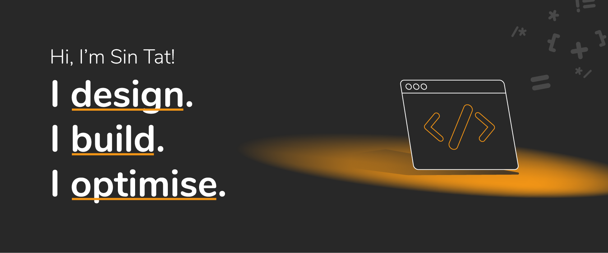

# I’m Sin-Tat
Hi there 👋 I’m Sin-Tat.

I’m a passionate fullstack developer with 9+ years of experience in web development. I’m eager to help companies build elegant, well-designed, cost-effective digital solutions that solve problems, engage with people, and boost productivity. 

<picture>
  <source media="(prefers-color-scheme: dark)" srcset="cover_github_dark.png">
  <source media="(prefers-color-scheme: light)" srcset="cover_github.png">
  
</picture>

## 🤓 What do I do?
**I design** -- System and interaction design.

**I build** -- Web frontend and backend.

**I optimise** -- Performance and user experience.

## 🧰 Technology Stack
I’m enthusiastic to build modern applications with various tools. I believe in *cloud-native architecture* which enables the delivery of scalable and cost-effective systems.

- **Web Frontend:** 
    - JavaScript: [React](https://reactjs.org), [Next.js](https://nextjs.org), [Vue.js](https://vuejs.org), [Nuxt](https://nuxtjs.org)
    - UI & CSS: [SCSS](https://sass-lang.com), [Tailwind CSS](https://tailwindcss.com), [Mantine](https://mantine.dev), [Vuetify](https://vuetifyjs.com)
    - Other Skills: Responsive Web Design, Web Animation, Static Site Generation, Web Accessibillity, UX
- **Backend:** 
    - [Node.js](https://nodejs.org), [TypeScript](https://www.typescriptlang.org), [NestJS](https://nestjs.com), [Express](https://expressjs.com), [Fastify](https://www.fastify.io)
    - [PHP](https://php.net), [Laravel](https://laravel.com)
- **App:** [Flutter](https://flutter.dev) ([Dart](https://dart.dev))
- **Database:** MySQL, MongoDB Atlas
- **Infrastructure:** 
    - Static Hosting: AWS Amplify, Azure Static Web Apps, Cloudflare Pages, Firebase Hosting
    - Serverless: AWS Lambda, MongoDB Atlas Function, Cloudflare Workers
    - Deployment: GitHub Actions, GitLab Runner, Pulumi

Technology never stops, my learning path neither. This is only a part of my skillsets. I’m always excited to keep learning new things! 🤩

## 🧑🏻‍💻 More about me
Many of my previous work are commercial projects that I could not publish the source code here. 🤐

But you can check out [my portfolio website](https://sintat.fan) to see a few selected projects and my [LinkedIn profile](https://www.linkedin.com/in/sintatfan) to know more about me.
